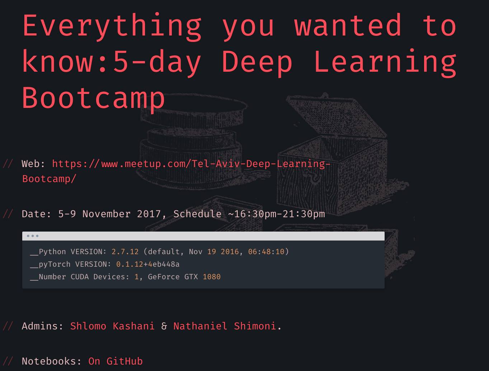
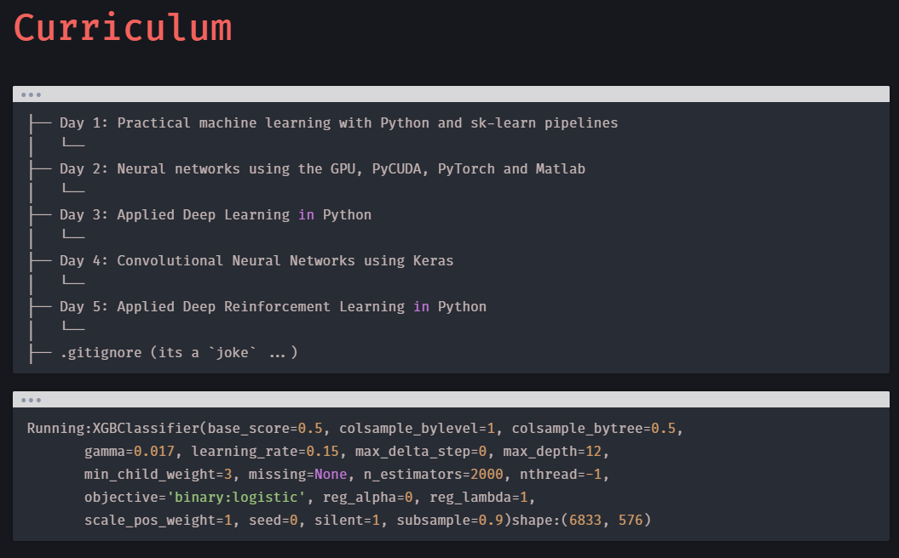

# Deep Learning Winter School, November 2107. 
## Tel Aviv Deep Learning Bootcamp : http://deep-ml.com. 

### About
Tel-Aviv Deep Learning Bootcamp is an intensive (and free!) 5-day program intended to teach you all about deep learning. It is nonprofit focused on advancing data science education and fostering entrepreneurship. The Bootcamp is a prominent venue for graduate students, researchers, and data science professionals. It offers a chance to study the essential and innovative aspects of deep learning.	

Participation is via a donation to the A.L.S ASSOCIATION for promoting research of the Amyotrophic Lateral Sclerosis (ALS) disease. 

### Curriculum
The Bootcamp amalgamates “Theory” and “Practice” – identifying that a deep learning scientist desires a survey of concepts combined with a strong application of practical techniques through labs. Primarily, the foundational material and tools of the Data Science practitioner are presented via Sk-Learn. Topics continue rapidly into exploratory data analysis and classical machine learning, where the data is organized, characterized, and manipulated. From day two, the students move from engineered models into 4 days of Deep Learning. 

## Bootcamp 5 day structure

The Bootcamp consists of the following folders and files:
 

- [day 01](day01/): 
Practical machine learning with Python and sk-learn pipelines

- [day 02 PyTORCH and PyCUDA](day-02-PyTORCH-and-PyCUDA): 
Neural networks using the GPU, PyCUDA, PyTorch and Matlab

- [day 03](day03): 
Applied Deep Learning in Python

- [day 04](day04): 
Convolutional Neural Networks using Keras

- [day 05](day05): 
Applied Deep Reinforcement Learning in Python

- [docker](docker): 
a GPU based docker system for the bootcamp

Click to view the full CURRICULUM : http://deep-ml.com/assets/5daydeep/#/3/1

#### Meetup:
https://www.meetup.com/TensorFlow-Tel-Aviv/events/241762893/

#### Registration:
https://www.eventbrite.com/e/5-day-deep-learning-bootcamp-november-2017-als-fund-raising-tickets-37001430274 

### Requirements
For a docker based system See https://github.com/QuantScientist/Data-Science-ArrayFire-GPU/tree/master/docker

- Ubuntu Linux 16.04
- Python 2.7 
- CUDA drivers.Running a CUDA container requires a machine with at least one CUDA-capable GPU and a driver compatible with the CUDA toolkit version you are using.

### The HTML slides were created using (You can run this directly from Jupyter):
`
%%bash
jupyter nbconvert \
    --to=slides \
    --reveal-prefix=https://cdnjs.cloudflare.com/ajax/libs/reveal.js/3.2.0/ \
    --output=py05.html \
    './05 PyTorch Automatic differentiation.ipynb'
`

 
## Dependencies

- For a GPU based docker system See https://github.com/QuantScientist/Data-Science-ArrayFire-GPU/tree/master/docker
- Ubuntu Linux 16.04
- Python 2.7 
- CUDA drivers.Running a CUDA container requires a machine with at least one CUDA-capable GPU and a driver compatible with the CUDA toolkit version you are using.

## IDE

This project has been realised with [*PyCharm*](https://www.jetbrains.com/pycharm/) by *JetBrains*

# Relevant info:

http://deep-ml.com/assets/5daydeep/#/3/1

## Author
Shlomo Kashani/ [@QuantScientist](https://github.com/QuantScientist) and many more. 
