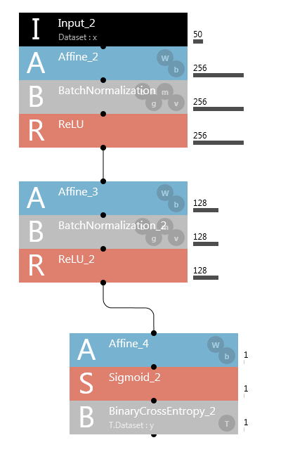
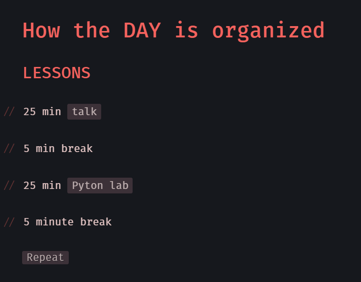

--------------------------------------------------------------------------------

# Deep Learning Bootcamp November 2017, GPU Computing for Data Scientists: PyTorch

Web: https://www.meetup.com/Tel-Aviv-Deep-Learning-Bootcamp/events/241762893/

https://www.meetup.com/Tel-Aviv-Deep-Learning-Bootcamp/events/242418339/

Notebooks: <a href="https://github.com/QuantScientist/Data-Science-PyCUDA-GPU"> On GitHub</a>

PyTorch is an optimized tensor library for Deep Learning, and is a recent newcomer to the growing list of GPU programming frameworks available in Python. Like other frameworks it offers efficient tensor representations and is agnostic to the underlying hardware. However, unlike other frameworks it allows you to create “define-by-run” neural networks resulting in dynamic computation graphs, where every single iteration can be different—opening up a whole new world of possibilities. Central to all neural networks in PyTorch is the Autograd package, which performs Algorithmic Differentiation on the defined model and generates the required gradients at each iteration.

***Keywords: GPU Processing, Algorithmic Differentiation, Deep Learning, Linear algebra.***

--------------------------------------------------------------------------------

--------------------------------------------------------------------------------

## *Jupyter Notebooks*

This repo contains the *PyTorch* implementations of *various Deep Learning Algorithms*.  
*Jupyter Notebooks* are a very effective tool for interactive data exploration and visualisation.

## List of Tutorials

| Title        | Description           |
| ------------- |-------------|
| [Binary Classification with MLP]https://github.com/QuantScientist/Deep-Learning-Boot-Camp/blob/master/day%2002%20PyTORCH%20and%20PyCUDA/PyTorch/18-PyTorch-NUMER.AI-Binary-Classification-BCELoss.ipynb) | NUMER.AI Deep Learning Binary Classification using BCELoss. |
| [[Binary Classification with CNN]https://github.com/QuantScientist/Deep-Learning-Boot-Camp/blob/master/day%2002%20PyTORCH%20and%20PyCUDA/PyTorch/55-PyTorch-using-CONV1D-on-one-dimensional-data-CNN.ipynb) | NUMER.AI Deep Learning Binary Classification using CNN. |

### The HTML slides were created using:
`
%%bash
jupyter nbconvert \
    --to=slides \
    --reveal-prefix=https://cdnjs.cloudflare.com/ajax/libs/reveal.js/3.2.0/ \
    --output=py05.html \
    './05 PyTorch Automatic differentiation.ipynb'
`

## Project structure

The project consists of the following folders and files:

 - [`data/`](data): contains *Data sets used in the Jupyter Notebooks*,  
 - [`notebook/`](notebook): collection of PyTorch *Jupyter Notebook*s for data exploration and results visualisation;
 -
 
## Dependencies

- For a GPU based docker system See https://github.com/QuantScientist/Data-Science-ArrayFire-GPU/tree/master/docker
- Ubuntu Linux 16.04
- Python 2.7 
- CUDA drivers.Running a CUDA container requires a machine with at least one CUDA-capable GPU and a driver compatible with the CUDA toolkit version you are using.

## IDE

This project has been realised with [*PyCharm*](https://www.jetbrains.com/pycharm/) by *JetBrains*

### GPU selection

Let's say your machine has `N` GPUs.
You can choose to use any of these, by specifying the index `n = 0, ..., N-1`.
Therefore, type `CUDA_VISIBLE_DEVICES=n` just before `python ...` in the following sections.

# Workshop Agenda:

#### Module 1 Getting Started  

- What is Pytorch

- Install and Run Pytorch

- Allocating CPU Tensors using PyTorch

- Allocating GPU Tensors using PyTorch 

#### Module 2 Basic Pytorch Operations

- Tensor Operation

- Numpy Bridge

- Variable

- Gradients and Autograd

#### Module 3 Data Pre-processing

- Install and Run Torchvision

- Datasets

- Data Transformation

#### Module 4 Linear/Logistic Regression with Pytorch

- Loss Function 

- Optimizer

- Training

#### Module 5 Neural Network (NN) with Pytorch

- What is Neural Network 

- Activation Functions

- Deep Neural Network with Pytorch

#### Module 7 Convolutional Neural Network (CNN) with Pytorch

- What is CNN?

- CNN Architecture

- Convolution 

- Pooling and Stride

- Dropout

## Author
Shlomo Kashani/ [@QuantScientist](https://github.com/QuantScientist)

# A very comprehensice list of PyTorch links:

