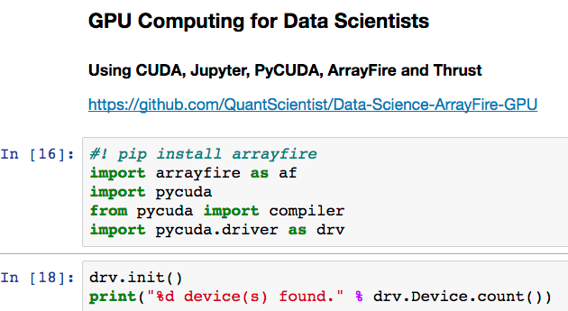

# All-in-one Jupyter Docker image for GPU Deep Learning using PyCUDA, PyTORCH, CUDA etc. 

## Build and Run the GPU image (see below for more info)

`docker build -t quantscientist/pycuda -f Dockerfile.gpu3 .`

`nvidia-docker run -it -p 5555:5555 -p 7842:7842 -p 8787:8787 -p 8786:8786 -p 8788:8788 -v ~/db/Dropbox/dev2/:/root/sharedfolder  quantscientist/pycuda bash`

This repository includes utilities to build and run my NVIDIA Docker image for **the Deep Learning School**:
https://www.meetup.com/TensorFlow-Tel-Aviv/events/241762893/

NOTE: Building this image may take several hours since CMAKE is being built from source. 
https://github.com/QuantScientist/deep-ml-meetups

Also available on docker hub (Build on docker hub usually failes because of the long build time):
https://hub.docker.com/r/quantscientist/deep-learning-boot-camp/

`docker pull quantscientist/deep-learning-boot-camp`

Please be aware that this project is currently **experimental**.

### CUDA requirements

Running a CUDA container requires a machine with at least one CUDA-capable GPU and a driver compatible with the CUDA toolkit version you are using.

NVIDIA drivers are **backward-compatible** with CUDA toolkits versions:

CUDA toolkit version   | Minimum driver version
:---------------------:|:-----------------------:
  7.0                  | >= 346.46
  7.5                  | >= 352.39
  
** We use CUDA 8.0. **   

### Get the toolkit:
`sudo apt-get install nvidia-cuda-toolkit`

### Get nsight IDE:
`sudo apt-get install nvidia-nsight`

### Install nvidia-docker and nvidia-docker-plugin
`wget -P /tmp https://github.com/NVIDIA/nvidia-docker/releases/download/v1.0.1/nvidia-docker_1.0.1-1_amd64.deb
sudo dpkg -i /tmp/nvidia-docker*.deb && rm /tmp/nvidia-docker*.deb`

#### Get nvidia docker (requires docker-engine **NOT** docker.io):
`nvidia-docker run --rm nvidia/cuda nvidia-smi`

# Image contents
On top of all the fancy deep learning libraries, this docker image contains:

Ubuntu 16.04
CUDA 8.0 (GPU version only)
cuDNN v5 (GPU version only)
Tensorflow
Theano
Keras
iPython/Jupyter Notebook
Numpy, SciPy, Pandas, Scikit Learn, Matplotlib
A few common libraries used for deep learning

* ArrayFire
* PyCUDA
* Python 
* LLVM
* LLDB
* Snappy
* Numba
 
# Build the image
### GPU version
`docker build -t quantscientist/pycuda -f Dockerfile.gpu3 .`

### CPU version
`docker build -t quantscientist/pycuda -f Dockerfile.cpu .`

# Run the GPU image
`nvidia-docker run -it -p 5555:5555 -p 7842:7842 -p 8787:8787 -p 8786:8786 -p 8788:8788 -v ~/db/Dropbox/dev2/:/root/sharedfolder  quantscientist/pycuda bash`

# Run the GPU image
`docker run -it -p 5555:5555 -p 7842:7842 -p 8787:8787 -p 8786:8786 -p 8788:8788 -v /myhome/data-science/:/root/sharedfolder  --env="DISPLAY" quantscientist/pycuda bash`

# Run Jupyter
`chmod +x run_jupyter.sh
./run_jupyter.sh`

OR

`docker build -t quantscientist/gpu -f Dockerfile.gpu .`

# Issues and Contributing
* Please let us know by [filing a new issue](https://github.com/QuantScientist/Data-Science-ArrayFire-GPU/issues/new)
* You can contribute by opening a [pull request](https://help.github.com/articles/using-pull-requests/)  
You will need to send a signed copy of the [Contributor License Agreement](CLA) to digits@nvidia.com before your change can be accepted.
